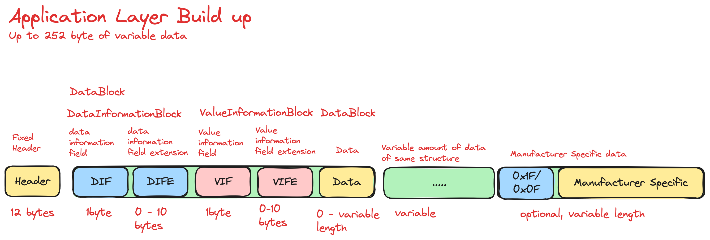
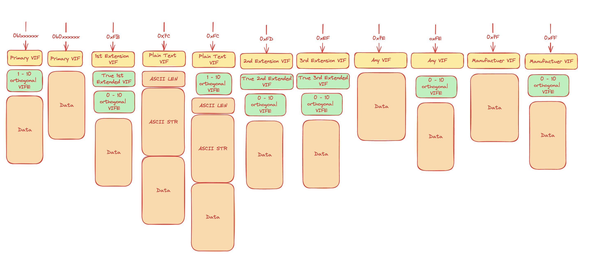

# m-bus-parser (wired)

[](https://discord.gg/FfmecQ4wua)
[](https://crates.io/crates/m-bus-parser) [](https://crates.io/crates/m-bus-parser) [](https://crates.io/crates/m-bus-parser) [](https://docs.rs/m-bus-parser) [](https://github.com/maebli/m-bus-parser/actions/workflows/rust.yml)

### Introduction 

*For contributing see [CONTRIBUTING.md](./CONTRIBUTING.md)*

m-bus-parser is an open source parser (sometimes also refered to as decoder and/or deserializer) of **wired** m-bus portocol and is written in rust. 

"M-Bus or Meter-Bus is a European standard (EN 13757-2 physical and link layer, EN 13757-3 application layer) for the remote reading of water, gas or electricity meters. M-Bus is also usable for other types of consumption meters, such as heating systems or water meters. The M-Bus interface is made for communication on two wires, making it cost-effective." - [Wikipedia](https://en.wikipedia.org/wiki/Meter-Bus)

An outdated specification is available freely on the [m-bus website](https://m-bus.com/documentation). This document is a good starting point for understanding the protocol. There have been many other implementations of the specification. 

Furthermore, the Open Metering System (OMS) Group has published a specification for the m-bus protocol. This specification is available for free on the [OMS website](https://www.oms-group.org/en/) or more specificially [here](https://oms-group.org/en/open-metering-system/oms-specification).


 such as a no longer maitained [ m-bus encoder and decoder by rscada](https://github.com/rscada/libmbus) written in **c**, [jMbus](https://github.com/qvest-digital/jmbus) written in **java**,[Valley.Net.Protocols.MeterBus](https://github.com/sympthom/Valley.Net.Protocols.MeterBus/) written in **C#**, [tmbus](https://dev-lab.github.io/tmbus/) written in javascript or [pyMeterBus](https://github.com/ganehag/pyMeterBus) written in python.


## Dependants and Deployments

### NPM Wasm Package
[](https://www.npmjs.com/package/m-bus-parser-wasm-pack) [](https://www.npmjs.com/package/m-bus-parser-wasm-pack)

The parser has been published as an npm package and can be used in the browser. An example of this can be seen under the url [https://maebli.github.io/m-bus-parser/](https://maebli.github.io/m-bus-parser/).

The source is in the wasm folder in this repos 


### CLI rust crate
[](https://crates.io/crates/m-bus-parser-cli) [](https://crates.io/crates/m-bus-parser-cli)

There is a cli, the source is in the sub folder "cli" and is published on crates.io [https://crates.io/crates/m-bus-parser-cli](https://crates.io/crates/m-bus-parser-cli).


### Visualization of Library Function

Do not get confused about the different types of frame types. The most important one to understand at first is the `LongFrame` which is the most common frame type. The others are for example for searching for a slave or for setting the primary address of a slave. This is not of primary intrest for most users. Visualization was made with the help of the tool [excalidraw](https://excalidraw.com/).


### Visualization of Serialized Application Layer

The searlized application layer above can be further broken into parsable parts.




### Value Information Block Serialization



## Aim

- suitable for embedded targets `no_std`
- Follow the Rust API Guideline https://rust-lang.github.io/api-guidelines/
- minimal copy

## Development status 

The library is currently under development. It is able to parse the link layer but not the application layer. The next goal is to parse the application layer. Once this is achieved the library will be released as `v0.1.0`. Further goals, such as decryption, will be set after this milestone is achieved. 

## Example of current function

Examples taken from https://m-bus.com/documentation-wired/06-application-layer:

1. Set the slave to primary address 8 without changing anything else:

``INPUT: 68 06 06 68 | 53 FE 51 | 01 7A 08 | 25 16``

Parsing the frame using the library (the data is not yet parsable with the lib):

```rust
   
    use m_bus_parser::frames::{Address, Frame, Function};

    let example = vec![ 
        0x68, 0x06, 0x06, 0x68, 
        0x53, 0xFE, 0x51, 
        0x01, 0x7A, 0x08, 
        0x25, 0x16,
    ];

    let frame = Frame::try_from(example.as_slice()))?;

    if let Frame::ControlFrame { function, address, data } = frame {
        assert_eq!(address, Address::Broadcast { reply_required: true });
        assert_eq!(function, Function::SndUd { fcb: (false)});
        assert_eq!(data, &[0x51,0x01, 0x7A, 0x08]);
    }

```
