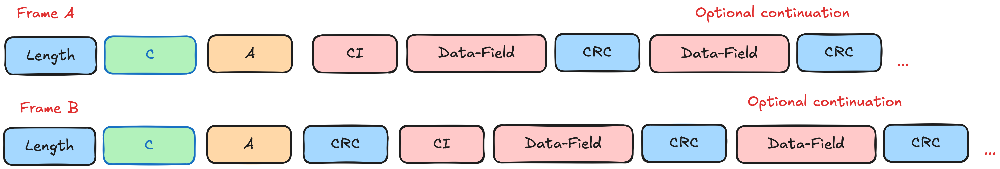

# m-bus-parser

[](https://discord.gg/FfmecQ4wua)
[](https://crates.io/crates/m-bus-parser) [](https://crates.io/crates/m-bus-parser) [](https://crates.io/crates/m-bus-parser) [](https://docs.rs/m-bus-parser) [](https://github.com/maebli/m-bus-parser/actions/workflows/rust.yml)


### Introduction 

*For contributing see [CONTRIBUTING.md](./CONTRIBUTING.md), for change history see [CHANGELOG.md](./CHANGELOG.md),*

m-bus-parser is an open source  parser (sometimes also refered to as decoder and/or deserializer) of **wired** and **wireless** m-bus portocol and is written in rust. 

"M-Bus or Meter-Bus is a European standard (EN 13757-2 physical and link layer, EN 13757-3 application layer) for the remote reading of water, gas or electricity meters. M-Bus is also usable for other types of consumption meters, such as heating systems or water meters. The M-Bus interface is made for communication on two wires, making it cost-effective." - [Wikipedia](https://en.wikipedia.org/wiki/Meter-Bus)

An outdated specification is available freely on the [m-bus website](https://m-bus.com/documentation). This document is a good starting point for understanding the protocol. There have been many other implementations of the specification. 

Furthermore, the Open Metering System (OMS) Group has published a specification for the m-bus protocol. This specification is available for free on the [OMS website](https://www.oms-group.org/en/) or more specificially [here](https://oms-group.org/en/open-metering-system/oms-specification).

There are many m bus parsers in the wild on github, such as a no longer maitained [ m-bus encoder and decoder by rscada](https://github.com/rscada/libmbus) written in **c**, [jMbus](https://github.com/qvest-digital/jmbus) written in **java**,[Valley.Net.Protocols.MeterBus](https://github.com/sympthom/Valley.Net.Protocols.MeterBus/) written in **C#**, [tmbus](https://dev-lab.github.io/tmbus/) written in javascript or [pyMeterBus](https://github.com/ganehag/pyMeterBus) written in python.

## Supported Features

### Control Information Types

The parser currently supports the following Control Information (CI) types:

#### Implemented
- **ResetAtApplicationLevel** - Application layer reset
- **ResponseWithVariableDataStructure** - Variable data response (CI: 0x72, 0x76, 0x7A)
- **ResponseWithFixedDataStructure** - Fixed data response (CI: 0x73)
- **ApplicationLayerShortTransport** - Short transport layer frame (CI: 0x7D)
- **ApplicationLayerLongTransport** - Long transport layer frame (CI: 0x7E)
- **ExtendedLinkLayerI** - Extended link layer type I (CI: 0x8A)

#### Not Yet Implemented
The following CI types will return an `ApplicationLayerError::Unimplemented` error:
- SendData, SelectSlave, SynchronizeSlave
- SetBaudRate* (300, 600, 1200, 2400, 4800, 9600, 19200, 38400)
- OutputRAMContent, WriteRAMContent
- StartCalibrationTestMode, ReadEEPROM, StartSoftwareTest
- HashProcedure, SendErrorStatus, SendAlarmStatus
- DataSentWith*TransportLayer, CosemData*, ObisData*
- ApplicationLayerFormatFrame*, ClockSync*
- ApplicationError*, Alarm*, NetworkLayer*
- TransportLayer* (various types)
- ExtendedLinkLayerII, ExtendedLinkLayerIII

For a complete list, refer to EN 13757-3 specification.

### Value Information Units

Most common value information unit codes are supported. Some specialized units may return `DataInformationError::Unimplemented`:
- Reserved length values in variable length data
- Special functions data parsing
- Partial primary and extended value information unit codes

Contributions to implement additional CI types and value information units are welcome!

## Dependants and Deployments

### NPM Wasm Package
[](https://www.npmjs.com/package/m-bus-parser-wasm-pack) [](https://www.npmjs.com/package/m-bus-parser-wasm-pack)

The parser has been published as an npm package and can be used in the browser. An example of this can be seen under the url [https://maebli.github.io/m-bus-parser/](https://maebli.github.io/m-bus-parser/).

The source is in the wasm folder in this repos 


### CLI rust crate
[](https://crates.io/crates/m-bus-parser-cli) [](https://crates.io/crates/m-bus-parser-cli)

There is a cli, the source is in the sub folder "cli" and is published on crates.io [https://crates.io/crates/m-bus-parser-cli](https://crates.io/crates/m-bus-parser-cli).

### Python bindings
[](https://badge.fury.io/py/pymbusparser)

The are some python bindings, the source is in the sub folder "python" and is published on pypi [https://pypi.org/project/pymbusparser/](https://pypi.org/project/pymbusparser/).

### Visualization of Library Function

## Wireless Link Layer



## Wired Link Layer

The most common wired frame is the `LongFrame`. 


### Visualization of Serialized Application Layer

The searlized application layer above can be further broken into parsable parts.


### Value Information Block Serialization


## Simple example, parsing wired m bus frame

Examples taken from https://m-bus.com/documentation-wired/06-application-layer:

1. Set the slave to primary address 8 without changing anything else:

``INPUT: 68 06 06 68 | 53 FE 51 | 01 7A 08 | 25 16``

Parsing the frame using the library (the data is not yet parsable with the lib):

```rust

    use m_bus_parser::{Address, WiredFrame, Function};

    let example = vec![
        0x68, 0x06, 0x06, 0x68,
        0x53, 0xFE, 0x51,
        0x01, 0x7A, 0x08,
        0x25, 0x16,
    ];

    let frame = WiredFrame::try_from(example.as_slice())?;

    if let WiredFrame::ControlFrame { function, address, data } = frame {
        assert_eq!(address, Address::Broadcast { reply_required: true });
        assert_eq!(function, Function::SndUd { fcb: (false)});
        assert_eq!(data, &[0x51,0x01, 0x7A, 0x08]);
    }

```
