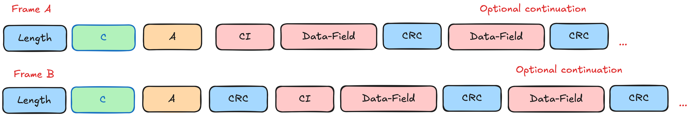
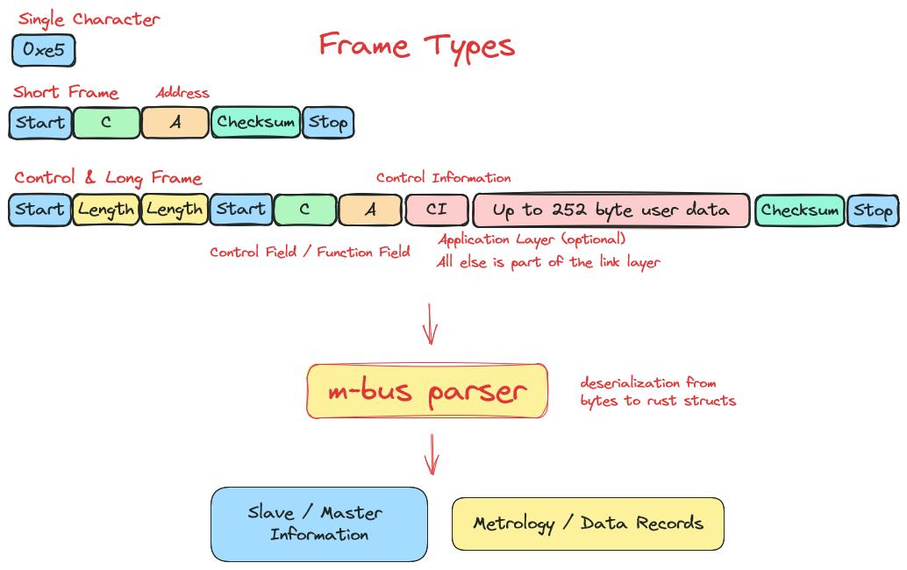
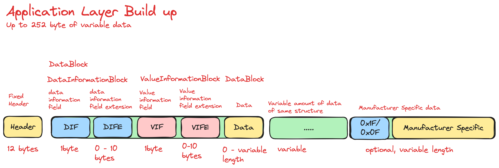
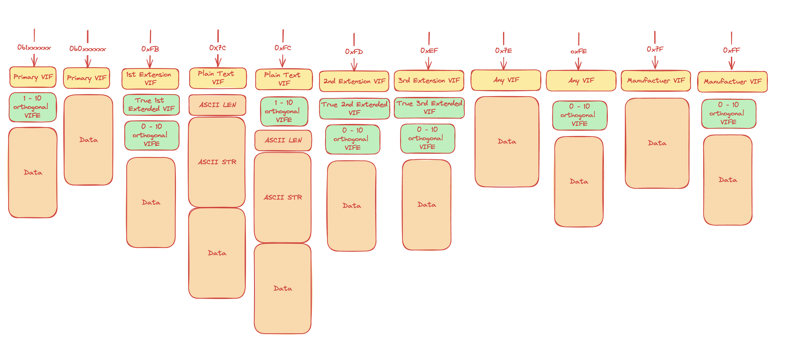

# m-bus-parser

[](https://discord.gg/FfmecQ4wua)
[](https://crates.io/crates/m-bus-parser)
[](https://crates.io/crates/m-bus-parser)
[](https://crates.io/crates/m-bus-parser)
[](https://docs.rs/m-bus-parser)
[](https://github.com/maebli/m-bus-parser/actions/workflows/rust.yml)

*For contributing see [CONTRIBUTING.md](./CONTRIBUTING.md), for change history see [CHANGELOG.md](./CHANGELOG.md).*

---

An open-source parser (decoder/deserializer) for the **wired** and **wireless** M-Bus protocol, written in Rust.

> M-Bus (Meter-Bus) is a European standard (EN 13757-2 physical and link layer, EN 13757-3 application layer) for remote reading of water, gas, electricity, and heat meters. — [Wikipedia](https://en.wikipedia.org/wiki/Meter-Bus)

- Try it live: **[maebli.github.io/m-bus-parser](https://maebli.github.io/m-bus-parser/)**
- Spec: [m-bus.com/documentation](https://m-bus.com/documentation) · [OMS specification](https://oms-group.org/en/open-metering-system/oms-specification)

---

## Features

- Parses **wired M-Bus** (EN 13757-2/-3) and **wireless M-Bus** (wMBus) frames
- **Five output formats**: `table`, `json`, `yaml`, `csv`, `mermaid`
- **Manufacturer lookup**: resolves 3-letter FLAG codes to full company name, website and description (110+ manufacturers)
- **AES-128 decryption** for encrypted wMBus frames (mode 5 / mode 7)
- **`no_std` compatible** — runs on embedded targets (manufacturer lookup and output formats require `std`)
- Available as a **Rust library**, **CLI**, **WebAssembly (npm)** and **Python bindings**

---

## Deployments

### Web app (WebAssembly)
[](https://www.npmjs.com/package/m-bus-parser-wasm-pack)
[](https://www.npmjs.com/package/m-bus-parser-wasm-pack)

Paste a hex frame at **[maebli.github.io/m-bus-parser](https://maebli.github.io/m-bus-parser/)** and get instant output in any format, including a rendered Mermaid diagram. Frames can be shared via URL.

Source: [`wasm/`](./wasm)

### CLI
[](https://crates.io/crates/m-bus-parser-cli)
[](https://crates.io/crates/m-bus-parser-cli)

```bash
cargo install m-bus-parser-cli
```

Source: [`cli/`](./cli)

### Python bindings
[](https://badge.fury.io/py/pymbusparser)

```bash
pip install pymbusparser
```

Source: [`python/`](./python)

---

## CLI Usage

```
m-bus-parser-cli parse [OPTIONS]

Options:
  -d, --data <DATA>      Raw M-Bus frame as a hex string
  -f, --file <FILE>      File containing a hex frame
  -t, --format <FORMAT>  Output format: table (default), json, yaml, csv, mermaid
  -k, --key <KEY>        AES-128 decryption key (32 hex characters)
```

Input hex can be in any of these forms:
```
68 3D 3D 68 ...      (space-separated)
683D3D68...          (plain hex)
0x68,0x3D,0x3D,...   (0x-prefixed, comma-separated)
```

### Table output (default)

```bash
m-bus-parser-cli parse -d "68 3D 3D 68 08 01 72 00 51 20 02 82 4D 02 04 00 88 00 00 \
  04 07 00 00 00 00 0C 15 03 00 00 00 0B 2E 00 00 00 0B 3B 00 00 00 0A 5A 88 12 \
  0A 5E 16 05 0B 61 23 77 00 02 6C 8C 11 02 27 37 0D 0F 60 00 67 16"
```

```
Long Frame
┌────────────────────────────────┬─────────────┐
│ Function                       │ Address     │
├────────────────────────────────┼─────────────┤
│ RspUd (ACD: false, DFC: false) │ Primary (1) │
└────────────────────────────────┴─────────────┘
┌───────────────────────┬──────────────────────────────────────────┐
│ Field                 │ Value                                    │
├───────────────────────┼──────────────────────────────────────────┤
│ Identification Number │ 02205100                                 │
├───────────────────────┼──────────────────────────────────────────┤
│ Manufacturer          │ SLB                                      │
├───────────────────────┼──────────────────────────────────────────┤
│ Manufacturer Name     │ Schlumberger Industries                  │
├───────────────────────┼──────────────────────────────────────────┤
│ Website               │ slb.com                                  │
├───────────────────────┼──────────────────────────────────────────┤
│ Description           │ Energy and water metering                │
├───────────────────────┼──────────────────────────────────────────┤
│ Access Number         │ 0                                        │
├───────────────────────┼──────────────────────────────────────────┤
│ Status                │ Permanent error, Manufacturer specific 3 │
├───────────────────────┼──────────────────────────────────────────┤
│ Security Mode         │ No encryption used                       │
├───────────────────────┼──────────────────────────────────────────┤
│ Version               │ 2                                        │
├───────────────────────┼──────────────────────────────────────────┤
│ DeviceType            │ Heat Meter (Return)                      │
└───────────────────────┴──────────────────────────────────────────┘
┌─────────────────────────────────────────┬───────────────────────┬────────────┬─────────────┐
│ Value                                   │ Data Information      │ Header Hex │ Data Hex    │
├─────────────────────────────────────────┼───────────────────────┼────────────┼─────────────┤
│ (0)e4[Wh]                               │ 0,Inst,32-bit Integer │ 04 07      │ 00 00 00 00 │
├─────────────────────────────────────────┼───────────────────────┼────────────┼─────────────┤
│ (3)e-1[m³](Volume)                      │ 0,Inst,BCD 8-digit    │ 0C 15      │ 03 00 00 00 │
├─────────────────────────────────────────┼───────────────────────┼────────────┼─────────────┤
│ (1288)e-1[°C]                           │ 0,Inst,BCD 4-digit    │ 0A 5A      │ 88 12       │
└─────────────────────────────────────────┴───────────────────────┴────────────┴─────────────┘
```

### Other formats

```bash
# JSON
m-bus-parser-cli parse -d "..." -t json

# YAML
m-bus-parser-cli parse -d "..." -t yaml

# CSV
m-bus-parser-cli parse -d "..." -t csv

# Mermaid diagram source (renders in the web app)
m-bus-parser-cli parse -d "..." -t mermaid

# With AES-128 decryption key
m-bus-parser-cli parse -d "..." -k "000102030405060708090A0B0C0D0E0F"
```

JSON output includes a `manufacturer_info` block for known FLAG codes:

```json
{
  "manufacturer_info": {
    "name": "Schlumberger Industries",
    "website": "slb.com",
    "description": "Energy and water metering"
  }
}
```

---

## Library Usage

Add to `Cargo.toml`:

```toml
[dependencies]
m-bus-parser = "0.1"
```

### Parse a wired frame

```rust
use m_bus_parser::{Address, WiredFrame, Function};
use m_bus_parser::mbus_data::MbusData;
use m_bus_parser::user_data::{DataRecords, UserDataBlock};

let frame_bytes: Vec<u8> = vec![
    0x68, 0x4D, 0x4D, 0x68, 0x08, 0x01, 0x72, 0x01,
    // ... rest of frame
];

let frame = WiredFrame::try_from(frame_bytes.as_slice())?;

if let WiredFrame::LongFrame { function, address, data } = frame {
    if let Ok(user_data) = UserDataBlock::try_from(data) {
        if let UserDataBlock::VariableDataStructureWithLongTplHeader {
            long_tpl_header,
            variable_data_block,
            ..
        } = user_data {
            let records = DataRecords::from((variable_data_block, &long_tpl_header));
            for record in records.flatten() {
                println!("{}", record.data);
            }
        }
    }
}
```

### Serialize to any format

```rust
use m_bus_parser::serialize_mbus_data;

let hex = "68 3D 3D 68 08 01 72 ...";

let table  = serialize_mbus_data(hex, "table",   None);
let json   = serialize_mbus_data(hex, "json",    None);
let yaml   = serialize_mbus_data(hex, "yaml",    None);
let csv    = serialize_mbus_data(hex, "csv",     None);
let mermaid = serialize_mbus_data(hex, "mermaid", None);

// With decryption key
let key: [u8; 16] = [0x00, 0x01, ..., 0x0F];
let decrypted = serialize_mbus_data(hex, "table", Some(&key));
```

### `no_std` usage

The core parsing types are `no_std` compatible. Disable default features:

```toml
[dependencies]
m-bus-parser = { version = "0.1", default-features = false }
```

An embedded example (Cortex-M) is in [`examples/cortex-m/`](./examples/cortex-m).

---

## Output Formats

| Format    | Flag    | Description                                      |
|-----------|---------|--------------------------------------------------|
| `table`   | default | Human-readable ASCII table                      |
| `json`    | `-t json`   | JSON with `manufacturer_info` block          |
| `yaml`    | `-t yaml`   | YAML with `manufacturer_info` block          |
| `csv`     | `-t csv`    | Comma-separated values                       |
| `mermaid` | `-t mermaid`| Mermaid flowchart source (renders in web app)|

---

## Manufacturer Lookup

The 3-letter [FLAG/DLMS manufacturer code](https://www.dlms.com/flag-id/) is automatically resolved to a full name, website, and description for 110+ registered M-Bus manufacturers (Kamstrup, Landis+Gyr, Itron, Diehl, Siemens, Zenner, Techem, etc.).

This lookup is available in all output formats and in the Rust API:

```rust
use m_bus_parser::manufacturers::lookup_manufacturer;

if let Some(info) = lookup_manufacturer("KAM") {
    println!("{} — {}", info.name, info.website);
    // Kamstrup A/S — kamstrup.com
}
```

---

## Protocol Coverage

### Frame types

| Type              | CI bytes               | Status      |
|-------------------|------------------------|-------------|
| Long frame        | 0x72, 0x76, 0x7A       | Supported   |
| Short frame       | —                      | Supported   |
| Control frame     | —                      | Supported   |
| Single character  | —                      | Supported   |
| Wireless frame    | wMBus link layer       | Supported   |

### CI field types

#### Implemented
- `ResponseWithVariableDataStructure` (CI: 0x72, 0x76, 0x7A)
- `ResponseWithFixedDataStructure` (CI: 0x73)
- `ApplicationLayerShortTransport` (CI: 0x7D)
- `ApplicationLayerLongTransport` (CI: 0x7E)
- `ExtendedLinkLayerI` (CI: 0x8A)
- `ResetAtApplicationLevel`

#### Not yet implemented
Returns `ApplicationLayerError::Unimplemented` for: `SendData`, `SelectSlave`, `SynchronizeSlave`, baud-rate commands, `ExtendedLinkLayerII/III`, COSEM/OBIS data, and various transport/network layer types.

Most common value information unit codes are supported. Contributions for additional CI types and VIF codes are welcome.

---

## Frame Structure

### Wireless Link Layer



### Wired Link Layer (Long Frame)



### Application Layer



### Value Information Block



---

## Related Projects

| Language | Project |
|----------|---------|
| C        | [libmbus by rscada](https://github.com/rscada/libmbus) |
| Java     | [jMbus](https://github.com/qvest-digital/jmbus) |
| C#       | [Valley.Net.Protocols.MeterBus](https://github.com/sympthom/Valley.Net.Protocols.MeterBus/) |
| JS       | [tmbus](https://dev-lab.github.io/tmbus/) |
| Python   | [pyMeterBus](https://github.com/ganehag/pyMeterBus) |
