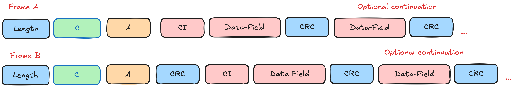
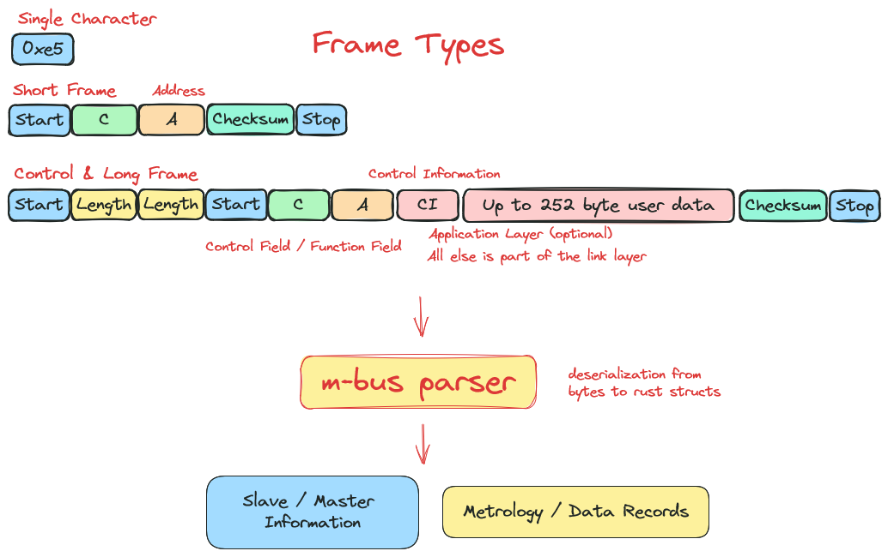
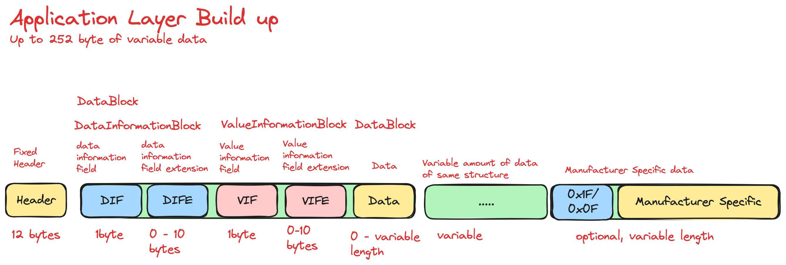
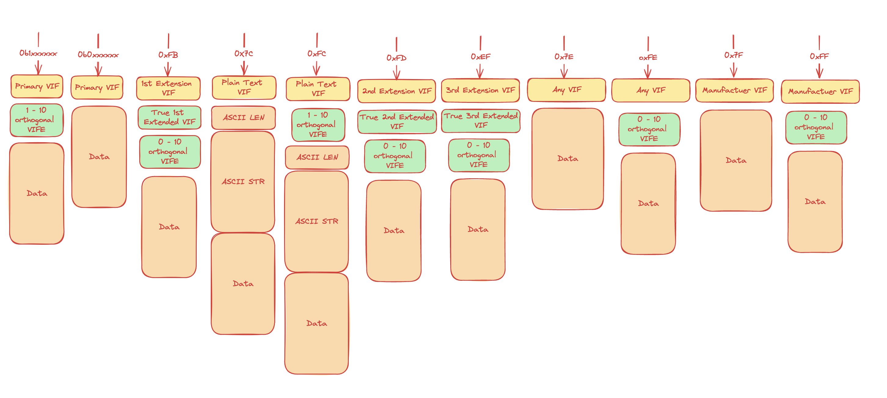

# m-bus-parser

[](https://discord.gg/FfmecQ4wua)
[](https://crates.io/crates/m-bus-parser)
[](https://crates.io/crates/m-bus-parser)
[](https://crates.io/crates/m-bus-parser)
[](https://docs.rs/m-bus-parser)
[](https://github.com/maebli/m-bus-parser/actions/workflows/rust.yml)
[](https://maebli.github.io/m-bus-parser/dev/bench/)

*For contributing see [CONTRIBUTING.md](./CONTRIBUTING.md), for change history see [CHANGELOG.md](./CHANGELOG.md).*

---

An open-source parser (decoder/deserializer) for the **wired** and **wireless** M-Bus protocol, written in Rust.

> M-Bus (Meter-Bus) is a European standard (EN 13757-2 physical and link layer, EN 13757-3 application layer) for remote reading of water, gas, electricity, and heat meters. — [Wikipedia](https://en.wikipedia.org/wiki/Meter-Bus)

- Try it live: **[maebli.github.io/m-bus-parser](https://maebli.github.io/m-bus-parser/)**
- Spec: [m-bus.com/documentation](https://m-bus.com/documentation) · [OMS specification](https://oms-group.org/en/open-metering-system/oms-specification)

---

## Features

- Parses **wired M-Bus** (EN 13757-2/-3) and **wireless M-Bus** (wMBus) frames
- **Eight harmonized output formats**: `table`, `json`, `yaml`, `csv`,
  `mermaid`, `xml`, `annotated`, and `annotated-text`
- A versioned canonical schema with exact decimal values, provenance,
  partial-decode diagnostics, and stable error codes
- Responsive, Unicode-aware tables for narrow terminals and browser cards
- **AES-128 decryption** for encrypted wMBus frames (mode 5 / mode 7)
- **`no_std` compatible** — runs on embedded targets (manufacturer lookup and output formats require `std`)
- Available as a **Rust library**, **CLI**, **WebAssembly (npm)** and **Python bindings**

Stack usage, linked footprint, and decode latency are measured by eagerly
parsing a wired frame and consuming all of its application-layer records with a
pinned compiler and dependency set. The badge above links to the
[per-commit resource charts](https://maebli.github.io/m-bus-parser/dev/bench/),
including the total critical path and each of its component frames. The
measurement method and local command are documented in
[`benches/parser-resources/`](./benches/parser-resources/).

---

## Deployments

### Web app (WebAssembly)
[](https://www.npmjs.com/package/m-bus-parser-wasm-pack)
[](https://www.npmjs.com/package/m-bus-parser-wasm-pack)

Paste a hex frame at **[maebli.github.io/m-bus-parser](https://maebli.github.io/m-bus-parser/)** and get instant output in any format, including a rendered Mermaid diagram. Frames can be shared via URL.

Source: [`wasm/`](./wasm)

### CLI
[](https://crates.io/crates/m-bus-parser-cli)
[](https://crates.io/crates/m-bus-parser-cli)

```bash
cargo install m-bus-parser-cli
```

Source: [`cli/`](./cli)

### Python bindings
[](https://badge.fury.io/py/pymbusparser)

```bash
pip install pymbusparser
```

Source: [`python/`](./python)

---

## CLI Usage

```
m-bus-parser-cli parse [OPTIONS]

Options:
  -d, --data <DATA>      Raw M-Bus frame as a hex string
  -f, --file <FILE>      File containing a hex frame
  -t, --format <FORMAT>  table, json, yaml, csv, mermaid, xml, annotated, annotated-text
  -k, --key <KEY>        AES-128 decryption key (32 hex characters)
      --width <WIDTH>    Table width (auto-detected on an interactive terminal)
      --no-enrichment    Omit manufacturer enrichment
```

Input hex is strict: use compact hexadecimal or complete byte tokens separated
by whitespace, colons, or hyphens.

```
68 04 04 68 53 01 00 00 54 16      (space-separated)
68040468530100005416                (plain hex)
0x68:0x04:0x04:0x68:0x53:0x01:0x00:0x00:0x54:0x16  (prefixed byte tokens)
```

### Table output (default)

The table automatically selects a wide, compact, or vertical-card layout and
never exceeds the detected terminal width. Use `--width 44` to request an exact
maximum explicitly.

### Other formats

```bash
FRAME="68 3D 3D 68 08 01 72 00 51 20 02 82 4D 02 04 00 88 00 00 04 07 00 00 00 00 0C 15 03 00 00 00 0B 2E 00 00 00 0B 3B 00 00 00 0A 5A 88 12 0A 5E 16 05 0B 61 23 77 00 02 6C 8C 11 02 27 37 0D 0F 60 00 67 16"

# JSON
m-bus-parser-cli parse -d "$FRAME" -t json

# YAML
m-bus-parser-cli parse -d "$FRAME" -t yaml

# CSV (one row per input frame; record fields use namespaced columns)
m-bus-parser-cli parse -d "$FRAME" -t csv

# Colored, semantically grouped Mermaid diagram source (renders in the web app)
m-bus-parser-cli parse -d "$FRAME" -t mermaid

# Wired-compatible and wireless XML
m-bus-parser-cli parse -d "$FRAME" -t xml

# Byte annotations as JSON or human-readable text
m-bus-parser-cli parse -d "$FRAME" -t annotated
m-bus-parser-cli parse -d "$FRAME" -t annotated-text

# Decrypt an AES-128-encrypted wireless frame
ENCRYPTED_FRAME="2E44931578563412330333637A2A0020255923C95AAA26D1B2E7493BC2AD013EC4A6F6D3529B520EDFF0EA6DEFC955B29D6D69EBF3EC8A"
m-bus-parser-cli parse -d "$ENCRYPTED_FRAME" -k "0102030405060708090A0B0C0D0E0F11"
```

---

## Library Usage

Add to `Cargo.toml`:

```toml
[dependencies]
m-bus-parser = { version = "0.4", features = ["std", "serde"] }
```

### Parse a wired frame

```rust
use m_bus_parser::WiredFrame;
use m_bus_parser::user_data::parse_application_layer;

fn main() -> Result<(), m_bus_parser::MbusError> {
    let frame_bytes: Vec<u8> = vec![
        0x68, 0x3D, 0x3D, 0x68, 0x08, 0x01, 0x72, 0x00,
        0x51, 0x20, 0x02, 0x82, 0x4D, 0x02, 0x04, 0x00,
        0x88, 0x00, 0x00, 0x04, 0x07, 0x00, 0x00, 0x00,
        0x00, 0x0C, 0x15, 0x03, 0x00, 0x00, 0x00, 0x0B,
        0x2E, 0x00, 0x00, 0x00, 0x0B, 0x3B, 0x00, 0x00,
        0x00, 0x0A, 0x5A, 0x88, 0x12, 0x0A, 0x5E, 0x16,
        0x05, 0x0B, 0x61, 0x23, 0x77, 0x00, 0x02, 0x6C,
        0x8C, 0x11, 0x02, 0x27, 0x37, 0x0D, 0x0F, 0x60,
        0x00, 0x67, 0x16,
    ];

    let frame = WiredFrame::try_from(frame_bytes.as_slice())?;

    if let WiredFrame::LongFrame { data, .. } = frame {
        let application_layer = parse_application_layer(data)?;
        if let Some(records) = application_layer.data_records() {
            for record in records {
                println!("{:?}", record?.value());
            }
        }
    }

    Ok(())
}
```

### Parse application-layer data records

When the link and transport headers have already been removed, parse the DIF/VIF
records directly:

```rust
use m_bus_parser::user_data::{DataRecordError, parse_data_records};

fn main() -> Result<(), DataRecordError> {
    let data = [0x03, 0x13, 0x15, 0x31, 0x00];
    for record in parse_data_records(&data) {
        let record = record?;
        println!("value: {:?}", record.value());
        println!("value information: {:?}", record.value_information());
    }

    Ok(())
}
```

### Decode and render with typed APIs

```rust
use m_bus_parser::{
    DecodeOptions, OutputError, OutputFormat, RenderOptions, decode_hex, render_hex,
};

fn main() -> Result<(), OutputError> {
    let hex = "68 3D 3D 68 08 01 72 00 51 20 02 82 4D 02 04 00 88 00 00 04 07 00 00 00 00 0C 15 03 00 00 00 0B 2E 00 00 00 0B 3B 00 00 00 0A 5A 88 12 0A 5E 16 05 0B 61 23 77 00 02 6C 8C 11 02 27 37 0D 0F 60 00 67 16";
    let decoded = decode_hex(hex, &DecodeOptions::default())?;
    println!("schema v{}: {}", decoded.schema_version, decoded.protocol);

    let table = render_hex(
        hex,
        OutputFormat::Table,
        &RenderOptions {
            table_width: Some(72),
            ..RenderOptions::default()
        },
    )?;
    println!("{table}");

    Ok(())
}
```

`serialize_mbus_data` remains as a string compatibility wrapper. New code
should use the typed APIs so invalid input and unsupported options remain
machine-readable `OutputError` values.

### `no_std` usage

The core parsing types are `no_std` compatible. Disable default features:

```toml
[dependencies]
m-bus-parser = { version = "0.4", default-features = false }
```

An embedded example (Cortex-M) is in [`examples/cortex-m/`](./examples/cortex-m).

---

## Testing

Run these commands from the repository root:

```bash
# Test the default no_std-compatible configuration
cargo test --no-default-features

# Test the std-enabled APIs and integration tests
cargo test --features std

# Test every optional feature, including serde and decryption
cargo test --all-features

# Test the alternate plaintext-before-extension behavior
cargo test --features plaintext-before-extension
```

The first command uses the host test harness but builds the parser without its
`std` feature. To also verify the library on a bare-metal target:

```bash
rustup target add thumbv7m-none-eabi
cargo build --target thumbv7m-none-eabi --no-default-features
```

### Run the Cortex-M QEMU demo

Install `qemu-system-arm`, make sure it is available on `PATH`, and add the
target with `rustup target add thumbv7m-none-eabi`. Then run the demo from the
repository root with this one-liner:

```bash
(cd examples/cortex-m && cargo run --release)
```

The example parses a frame, prints the result through semihosting, and exits
QEMU.

---

## Output Formats

| Format    | Flag    | Description                                      |
|-----------|---------|--------------------------------------------------|
| `table`         | default             | Width-aware human-readable table |
| `json`          | `-t json`           | Canonical schema as JSON |
| `yaml`          | `-t yaml`           | Canonical schema as YAML |
| `csv`           | `-t csv`            | One frame row with namespaced record columns |
| `mermaid`       | `-t mermaid`        | Colored, layer-oriented Mermaid flowchart |
| `xml`           | `-t xml`            | Wired libmbus-compatible and wireless XML |
| `annotated`     | `-t annotated`      | Byte-segment annotation envelope |
| `annotated-text`| `-t annotated-text` | Human-readable byte annotations |

### Naming and interoperability

The canonical JSON, YAML, CSV, table, Mermaid, Python, and WebAssembly outputs
share one vocabulary:

- JSON/YAML member names and annotation identifiers use `snake_case`.
- Link-layer functions use the M-Bus mnemonics (`RSP_UD`, `REQ_UD2`,
  `SND_NKE`). Record functions, quantities, and data codings use the terms from
  the M-Bus application-layer tables, such as `Instantaneous value`,
  `Volume flow`, and `6-digit BCD`.
- `unit` is a single case-sensitive [UCUM](https://ucum.org/ucum) expression
  when one is available, such as `W`, `Cel`, or `m3.h-1`.
- Complete temporal values use ISO 8601 notation. The parser does not invent a
  timezone when a meter does not transmit one.
- Each record value contains a `kind` and at most one parsed `value`. Exact
  decimals, text, and complete temporal values use strings; finite floats use
  JSON numbers; partial temporal values use a compact component object.
- Raw binary values use uppercase hexadecimal and fields containing them end
  in `_hex`. Record bytes live only in `header_hex` and `data_hex`.

There is no common JSON schema shared by M-Bus parsers. These rules retain the
protocol vocabulary used by [M-Bus](https://m-bus.com/documentation-wired/06-application-layer)
and libmbus while keeping the structured formats predictable. The `xml` format
deliberately retains libmbus's established XML vocabulary and unit symbols for
compatibility. Formats whose names end in `-legacy` retain their historical
contracts.

---

## Protocol Coverage

### Frame types

| Type              | CI bytes               | Status      |
|-------------------|------------------------|-------------|
| Long frame        | 0x72, 0x76, 0x7A       | Supported   |
| Short frame       | —                      | Supported   |
| Control frame     | —                      | Supported   |
| Single character  | —                      | Supported   |
| Wireless frame    | wMBus link layer       | Supported   |

### CI field types

#### Implemented
- `ResponseWithVariableDataStructure` (CI: 0x72, 0x76, 0x7A)
- `ResponseWithFixedDataStructure` (CI: 0x73)
- `ApplicationLayerShortTransport` (CI: 0x7D)
- `ApplicationLayerLongTransport` (CI: 0x7E)
- `ExtendedLinkLayerI` (CI: 0x8A)
- `ResetAtApplicationLevel`

#### Not yet implemented
Returns `ApplicationLayerError::Unimplemented` for: `SendData`, `SelectSlave`, `SynchronizeSlave`, baud-rate commands, `ExtendedLinkLayerII/III`, COSEM/OBIS data, and various transport/network layer types.

Most common value information unit codes are supported. Contributions for additional CI types and VIF codes are welcome.

---

## Frame Structure

### Wireless Link Layer



### Wired Link Layer (Long Frame)



### Application Layer



### Value Information Block



---

## Related Projects

| Language | Project |
|----------|---------|
| C        | [libmbus by rscada](https://github.com/rscada/libmbus) |
| Java     | [jMbus](https://github.com/qvest-digital/jmbus) |
| C#       | [Valley.Net.Protocols.MeterBus](https://github.com/sympthom/Valley.Net.Protocols.MeterBus/) |
| JS       | [tmbus](https://dev-lab.github.io/tmbus/) |
| Python   | [pyMeterBus](https://github.com/ganehag/pyMeterBus) |
